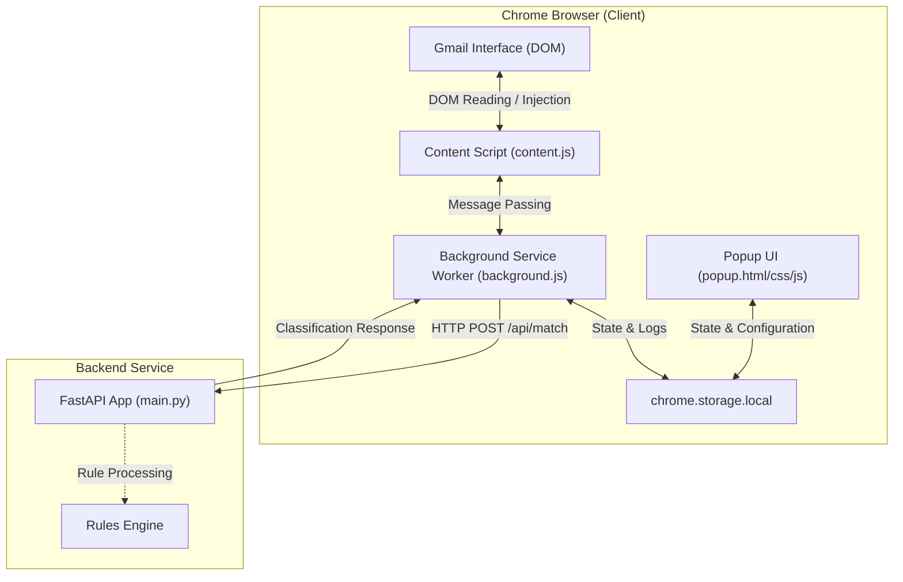

# MailMatch Architecture Overview

MailMatch is an open-source assistant designed to automatically parse, classify, and orchestrate workflows from email web clients (e.g., Gmail) using a combination of a Chrome Extension and a FastAPI backend service.

## Architecture Diagram

## System Components

### 1. Chrome Extension (`extension/`)
- **`popup.html/css/js`**: Interactive console popup providing system toggles, backend connectivity settings, and recent match logs.
- **`background.js`**: Background service worker acting as the central message coordinator and handler of HTTP communication with the backend.

### 2. Backend Server (`backend/`)
- **`main.py`**: FastAPI entrypoint hosting the HTTP server.
- **`/health`**: Endpoint checks server availability.
- **`/api/match`**: Endpoint runs rules-based matches and returns classification categories and triggered action hooks.

### 3. Documentation (`docs/`)
- Comprehensive specifications of API contracts, client installation, and deployment configurations.
